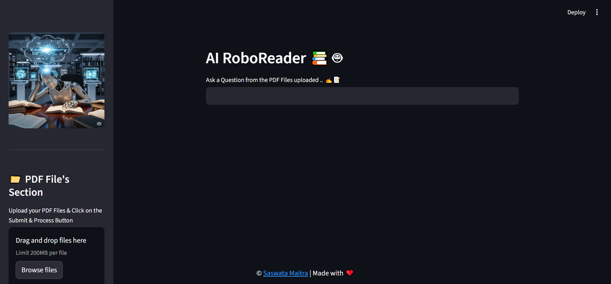
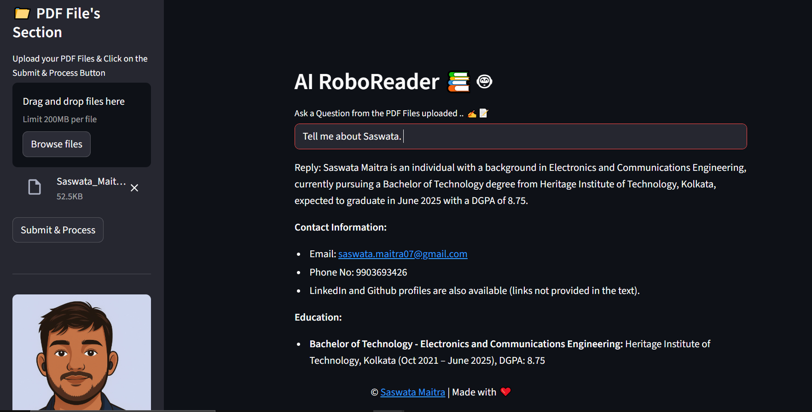

# 📚 AI RoboReader 🤖  
An **AI-powered Multi-PDF Chatbot** built with **Streamlit, LangChain, FAISS, and Google Gemini API**.  
This app allows you to **upload multiple PDFs** and ask **questions**. It processes the documents, creates embeddings, and retrieves accurate answers using **context-aware AI**.  

---

## 🚀 Features  
- 📁 Upload and process multiple PDF files.  
- 🔍 Extracts and splits text into manageable chunks.  
- 🧠 Creates vector embeddings using **Google Generative AI Embeddings**.  
- 💬 Asks questions and gets **contextual answers** from your documents.  
- ⚡ Powered by **Gemini 2.5 Flash** for fast and accurate responses.  
- 🎨 Clean and interactive UI with **Streamlit**.  

---

## 🛠️ Tech Stack  
- **[Python](https://www.python.org/downloads/release/python-3125/)** → Python Version: 3.12.5
- **[Streamlit](https://streamlit.io/)** → UI framework  
- **[LangChain](https://www.langchain.com/)** → Document processing & conversational chain  
- **[FAISS](https://faiss.ai/)** → Vector database for similarity search  
- **[Google Gemini API](https://ai.google.dev/)** → Embeddings & LLM responses  
- **[PyPDF2](https://pypi.org/project/PyPDF2/)** → PDF text extraction  
- **Python dotenv** → API key management  

---

## 📂 Project Structure  

---
- 📦 AI RoboReader
- ├── app.py # Main Streamlit app
- ├── img/
- │ ├── RoboLearn.png # Sidebar image
- │ └── Saswata.png # Creator image
- ├── faiss_index/ # Saved FAISS vector database
- ├── .env # Store your GOOGLE_API_KEY
- ├── requirements.txt # Dependencies
- └── README.md # Documentation
---


---

## ⚙️ Setup & Installation  

1. **Clone the repository**  
   ```bash
   git clone https://github.com/your-username/AI-RoboReader.git
   cd AI-RoboReader

2. **Create virtual environment & activate**
    ```bash
    python -m venv myenv
    source myenv/bin/activate   # for Linux/Mac
    myenv\Scripts\activate      # for Windows

3. **Install dependencies**
    ```bash
    pip install -r requirements.txt


4. **Add your Google API key**
        Create a .env file in the project root and add:
     ```bash
    GOOGLE_API_KEY=your_api_key_here


5. **Run the Streamlit app**
        ```bash
        streamlit run app.py
---

## 📖 Usage  

1. Upload one or more PDF files from the **sidebar**.  
2. Click on **Submit & Process** → This extracts, chunks, and indexes the text into FAISS.  
3. Ask your **question** in the input box at the top.  
4. Get AI-powered, **contextual answers** instantly.  

---

## 📸 Screenshots  

| Home Page | QNA       |
|-----------|----------|
|  |  |

---

## 🧑‍💻 Author  

👤 **Saswata Maitra**  
- GitHub: [@Saswata777](https://github.com/Saswata777)  

---

## ⚡ Future Enhancements  

- 🔗 Support for **other document types** (DOCX, TXT, etc.)  
- 🌐 Deploy on **Streamlit Cloud / Hugging Face Spaces**  
- 📊 Advanced visualization of PDF data  

---


